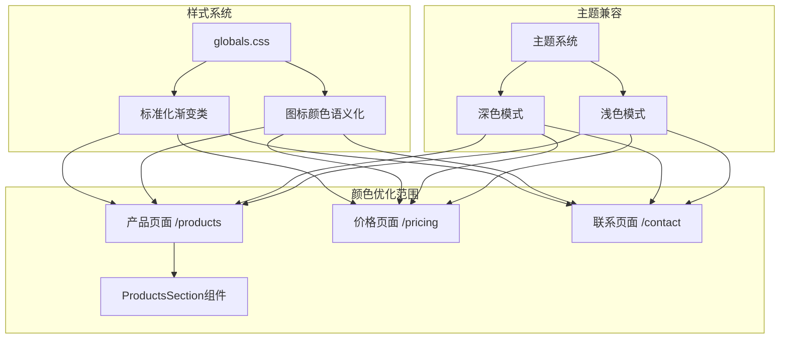
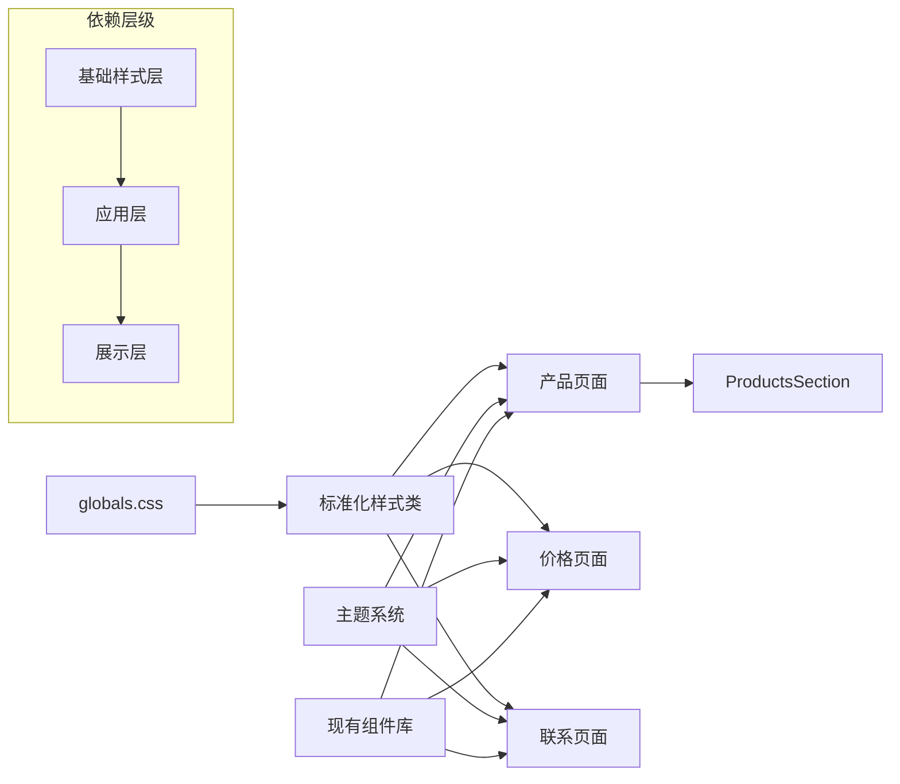
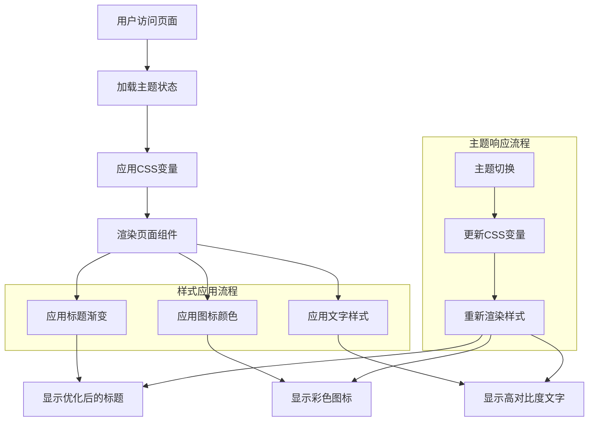

# UI颜色优化架构设计文档

## 整体架构图



## 分层设计

### 1. 样式基础层 (Style Foundation)
**文件**: `app/globals.css`

**职责**:
- 定义标准化渐变类
- 提供图标颜色语义化方案
- 确保主题兼容性

**新增CSS类**:
```css
/* 标题渐变样式 */
.title-gradient {
  @apply bg-gradient-to-r from-primary via-blue-500 to-primary/80 bg-clip-text text-transparent;
}

.title-gradient-alt {
  @apply bg-gradient-to-r from-primary to-secondary bg-clip-text text-transparent;
}

/* 图标颜色语义化 */
.icon-contact { @apply text-green-500; }
.icon-feature { @apply text-primary; }
.icon-email { @apply text-purple-500; }
.icon-success { @apply text-green-500; }
.icon-ai { @apply text-blue-500; }
.icon-enterprise { @apply text-orange-500; }
```

### 2. 页面应用层 (Page Application)
**文件**: 
- `app/products/page.tsx`
- `app/pricing/page.tsx` 
- `app/contact/page.tsx`
- `components/products-section.tsx`

**职责**:
- 应用标准化样式类
- 实现具体的颜色优化
- 保持响应式设计

### 3. 主题兼容层 (Theme Compatibility)
**现有系统**: 
- `components/theme-provider.tsx`
- CSS变量系统

**职责**:
- 确保新样式在深色/浅色模式下正常工作
- 维持主题切换功能

## 核心组件设计

### 1. 样式类组件 (Style Classes)

```typescript
// 标题渐变类型定义
type TitleGradientType = 'primary' | 'alt';

// 图标颜色类型定义
type IconColorType = 'contact' | 'feature' | 'email' | 'success' | 'ai' | 'enterprise';

// 样式工具函数
const getTitleGradientClass = (type: TitleGradientType = 'primary') => {
  return type === 'primary' ? 'title-gradient' : 'title-gradient-alt';
};

const getIconColorClass = (type: IconColorType) => {
  return `icon-${type}`;
};
```

### 2. 页面组件更新模式

```typescript
// 更新前
<h1 className="text-foreground">标题</h1>
<Icon className="text-muted-foreground" />
<p className="text-muted-foreground">描述文字</p>

// 更新后
<h1 className="title-gradient">标题</h1>
<Icon className="icon-feature" />
<p className="text-foreground">描述文字</p>
```

## 模块依赖关系图



## 接口契约定义

### 1. CSS类接口

```css
/* 标题渐变接口 */
.title-gradient {
  /* 主要蓝色渐变 */
  background: linear-gradient(to right, var(--primary), #3b82f6, var(--primary)/0.8);
  background-clip: text;
  -webkit-background-clip: text;
  color: transparent;
}

.title-gradient-alt {
  /* 备选渐变方案 */
  background: linear-gradient(to right, var(--primary), var(--secondary));
  background-clip: text;
  -webkit-background-clip: text;
  color: transparent;
}
```

### 2. 图标颜色接口

```css
/* 图标颜色语义化接口 */
.icon-contact { color: #10b981; }    /* 绿色 - 联系方式 */
.icon-feature { color: hsl(var(--primary)); }  /* 主色 - 功能特性 */
.icon-email { color: #8b5cf6; }      /* 紫色 - 邮件 */
.icon-success { color: #10b981; }    /* 绿色 - 成功状态 */
.icon-ai { color: #3b82f6; }         /* 蓝色 - AI功能 */
.icon-enterprise { color: #f97316; } /* 橙色 - 企业服务 */
```

### 3. 组件更新接口

```typescript
// 页面组件更新接口
interface PageOptimization {
  // 标题优化
  optimizeTitle(element: HTMLElement, gradientType?: TitleGradientType): void;
  
  // 图标优化
  optimizeIcon(element: HTMLElement, iconType: IconColorType): void;
  
  // 文字对比度优化
  optimizeTextContrast(element: HTMLElement): void;
}
```

## 数据流向图



## 异常处理策略

### 1. 样式降级策略
```css
/* 渐变不支持时的降级 */
.title-gradient {
  color: hsl(var(--primary)); /* 降级到单色 */
  background: linear-gradient(to right, var(--primary), #3b82f6, var(--primary)/0.8);
  background-clip: text;
  -webkit-background-clip: text;
  color: transparent;
}

/* 支持检测 */
@supports not (background-clip: text) {
  .title-gradient {
    color: hsl(var(--primary));
  }
}
```

### 2. 主题兼容性处理
```css
/* 确保在所有主题下都有合适的对比度 */
.icon-contact {
  color: #10b981; /* 浅色模式 */
}

.dark .icon-contact {
  color: #34d399; /* 深色模式下稍微亮一些 */
}
```

### 3. 错误恢复机制
- 如果自定义样式失效，自动降级到原有样式
- 保持现有的 `text-foreground` 和 `text-muted-foreground` 作为备选
- 主题切换失败时保持当前样式状态

## 性能考虑

### 1. CSS优化
- 使用CSS变量减少重复定义
- 利用浏览器缓存机制
- 避免复杂的CSS选择器

### 2. 渲染优化
- 渐变样式使用GPU加速
- 避免频繁的样式重计算
- 保持现有的动画性能

### 3. 兼容性保证
- 渐进增强策略
- 优雅降级处理
- 跨浏览器兼容性测试

## 测试策略

### 1. 视觉回归测试
- 深色/浅色模式对比
- 不同屏幕尺寸测试
- 颜色对比度验证

### 2. 功能测试
- 主题切换功能
- 响应式布局
- 交互功能完整性

### 3. 性能测试
- 页面加载时间
- 样式渲染性能
- 内存使用情况