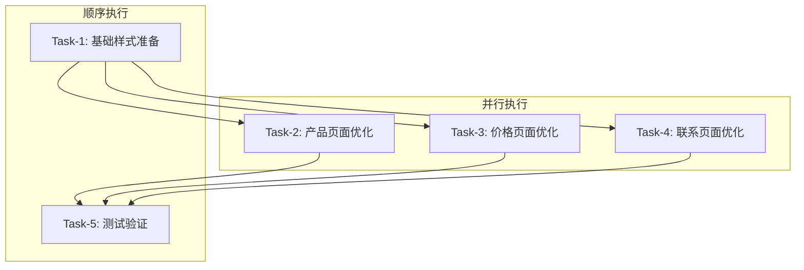

# UI颜色优化任务分解文档

## 任务概览

将UI颜色优化分解为5个原子任务，按依赖关系顺序执行，确保每个任务可独立验证和测试。

## 任务依赖关系图

## 原子任务详细定义

### Task-1: 基础样式准备

**任务ID**: `ui-opt-001`  
**优先级**: 高  
**预估时间**: 15分钟  

#### 输入契约
- **前置依赖**: 无
- **输入数据**: 现有 `app/globals.css` 文件
- **环境依赖**: Next.js项目环境，Tailwind CSS配置

#### 输出契约
- **输出数据**: 更新后的 `globals.css` 文件
- **交付物**: 
  - 6个标准化CSS类定义
  - 主题兼容性样式
  - 降级处理样式
- **验收标准**: 
  - CSS语法正确无误
  - 类名符合命名规范
  - 支持深色/浅色模式
  - 浏览器兼容性良好

#### 实现约束
- **技术栈**: CSS, Tailwind CSS
- **接口规范**: 遵循现有CSS变量系统
- **质量要求**: 
  - 代码格式化规范
  - 注释清晰完整
  - 性能影响最小

#### 具体实现内容
1. 在 `globals.css` 末尾添加标准化渐变类
2. 添加图标颜色语义化类
3. 添加主题兼容性处理
4. 添加浏览器兼容性降级

---

### Task-2: 产品页面优化

**任务ID**: `ui-opt-002`  
**优先级**: 高  
**预估时间**: 25分钟  

#### 输入契约
- **前置依赖**: Task-1 完成
- **输入数据**: 
  - `app/products/page.tsx`
  - `components/products-section.tsx`
  - 新增的CSS类
- **环境依赖**: Task-1的CSS类可用

#### 输出契约
- **输出数据**: 优化后的产品页面组件
- **交付物**: 
  - 更新的 `app/products/page.tsx`
  - 更新的 `components/products-section.tsx`
- **验收标准**: 
  - 大标题使用蓝色渐变
  - 图标使用语义化颜色
  - 主要文字使用高对比度
  - 保持响应式设计
  - 深色/浅色模式正常

#### 实现约束
- **技术栈**: React, TypeScript, Tailwind CSS
- **接口规范**: 保持现有组件API不变
- **质量要求**: 
  - 组件功能完整性
  - 代码可读性
  - 性能无回归

#### 具体实现内容
1. 更新页面标题样式为 `title-gradient`
2. 更新产品卡片标题样式
3. 优化图标颜色（功能图标用 `icon-feature`）
4. 替换 `text-muted-foreground` 为 `text-foreground`
5. 保持现有动画和交互效果

---

### Task-3: 价格页面优化

**任务ID**: `ui-opt-003`  
**优先级**: 高  
**预估时间**: 20分钟  

#### 输入契约
- **前置依赖**: Task-1 完成
- **输入数据**: 
  - `app/pricing/page.tsx`
  - 新增的CSS类
- **环境依赖**: Task-1的CSS类可用

#### 输出契约
- **输出数据**: 优化后的价格页面
- **交付物**: 更新的 `app/pricing/page.tsx`
- **验收标准**: 
  - 主标题使用统一蓝色渐变
  - 价格卡片标题优化
  - 功能列表图标彩色化
  - FAQ标题样式统一
  - 深色/浅色模式兼容

#### 实现约束
- **技术栈**: React, TypeScript, Tailwind CSS
- **接口规范**: 保持现有页面结构
- **质量要求**: 
  - 价格信息准确性
  - 交互功能完整
  - 视觉层次清晰

#### 具体实现内容
1. 统一主标题渐变样式
2. 优化价格卡片视觉效果
3. 彩色化功能特性图标
4. 优化FAQ部分样式
5. 确保CTA按钮突出显示

---

### Task-4: 联系页面优化

**任务ID**: `ui-opt-004`  
**优先级**: 高  
**预估时间**: 25分钟  

#### 输入契约
- **前置依赖**: Task-1 完成
- **输入数据**: 
  - `app/contact/page.tsx`
  - 新增的CSS类
- **环境依赖**: Task-1的CSS类可用

#### 输出契约
- **输出数据**: 优化后的联系页面
- **交付物**: 更新的 `app/contact/page.tsx`
- **验收标准**: 
  - 主标题使用蓝色渐变
  - 联系方式图标使用绿色
  - 邮件图标使用紫色
  - 统计数据清晰显示
  - 表单样式优化

#### 实现约束
- **技术栈**: React, TypeScript, Tailwind CSS
- **接口规范**: 保持表单功能完整
- **质量要求**: 
  - 联系信息准确性
  - 表单验证功能
  - 响应式布局

#### 具体实现内容
1. 优化主标题渐变效果
2. 联系方式图标使用 `icon-contact`
3. 邮件相关图标使用 `icon-email`
4. 优化统计数据展示
5. 提升表单视觉效果
6. 优化FAQ部分样式

---

### Task-5: 测试验证

**任务ID**: `ui-opt-005`  
**优先级**: 中  
**预估时间**: 20分钟  

#### 输入契约
- **前置依赖**: Task-2, Task-3, Task-4 全部完成
- **输入数据**: 所有优化后的页面
- **环境依赖**: 开发服务器运行

#### 输出契约
- **输出数据**: 测试报告
- **交付物**: 
  - 功能测试结果
  - 视觉效果验证
  - 兼容性测试报告
- **验收标准**: 
  - 所有页面正常加载
  - 主题切换功能正常
  - 响应式设计正确
  - 颜色对比度符合标准

#### 实现约束
- **技术栈**: 浏览器开发者工具
- **接口规范**: 无破坏性变更
- **质量要求**: 
  - 全面的测试覆盖
  - 详细的问题记录
  - 性能影响评估

#### 具体测试内容
1. **功能测试**:
   - 页面导航正常
   - 表单提交功能
   - 按钮点击响应
   - 链接跳转正确

2. **主题测试**:
   - 深色模式切换
   - 浅色模式切换
   - 系统主题跟随
   - 主题持久化

3. **视觉测试**:
   - 标题渐变效果
   - 图标颜色正确
   - 文字对比度
   - 整体视觉协调

4. **响应式测试**:
   - 移动端显示
   - 平板端显示
   - 桌面端显示
   - 不同分辨率适配

5. **性能测试**:
   - 页面加载时间
   - 样式渲染性能
   - 内存使用情况

## 任务执行策略

### 执行顺序
1. **第一阶段**: 执行 Task-1（基础样式准备）
2. **第二阶段**: 并行执行 Task-2, Task-3, Task-4
3. **第三阶段**: 执行 Task-5（测试验证）

### 质量控制
- 每个任务完成后立即进行自验证
- 发现问题立即修复，不延续到下个任务
- 保持代码提交的原子性

### 风险控制
- 每个任务都有明确的回滚方案
- 保留原有样式作为备份
- 渐进式应用新样式

### 验收流程
1. 技术验收：代码质量、功能完整性
2. 视觉验收：设计效果、用户体验
3. 兼容性验收：多浏览器、多设备
4. 性能验收：加载速度、渲染性能

## 成功标准

### 整体目标达成
- ✅ 三个页面视觉清晰度显著提升
- ✅ 品牌识别度增强（蓝色渐变标题）
- ✅ 图标层次感明显（语义化颜色）
- ✅ 文字对比度改善（高对比度文字）

### 技术质量保证
- ✅ 无功能回归问题
- ✅ 主题系统兼容性完好
- ✅ 响应式设计保持
- ✅ 性能无明显影响

### 用户体验提升
- ✅ 内容可读性增强
- ✅ 视觉层次更清晰
- ✅ 品牌一致性提升
- ✅ 无障碍访问性改善